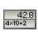

# dkalc 

dkalc is a simple calculator for Linux with programming like syntax and auto-evaluation.

## How to build

From a terminal, get git, Rust compiler, its Cargo build tool, and GTK+ development files:

```
sudo apt install git
sudo apt install rustc
sudo apt install cargo
sudo apt install libgtk-3-dev
```

Get the code, build it and run it:

```
git clone https://github.com/hadrien-psydk/dkalc
cd dkalc
cargo build
cargo run
```
